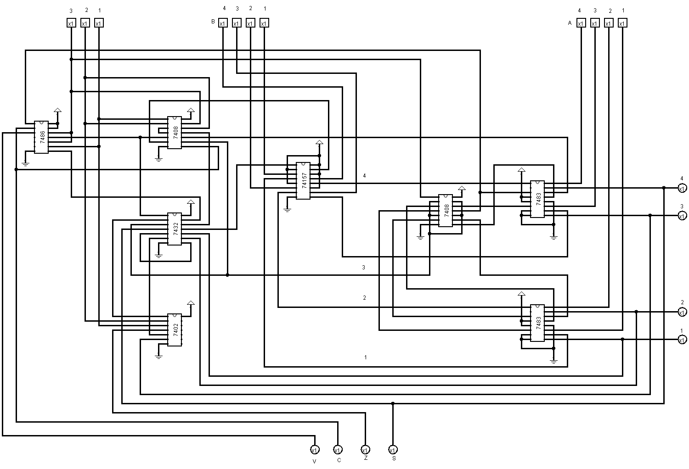

# 💻 4-Bit Arithmetic Logic Unit (ALU)

Welcome to the **4-Bit ALU** project directory! This section showcases the design and implementation of a 4-bit ALU built via **Logisim** using fundamental 7400-Series ICs.

## 🛠️ Project Overview

This design demonstrates a low-level approach to computer arithmetic, utilizing standard off-the-shelf TTL components to perform arithmetic and logical operations.

### **✨ Features**

- **Bit Width:** 4-bit Operations.
- **Core ICs Used:**
  - `7483` (4-Bit Binary Full Adder)
  - `74157` (Quad 2-to-1 Multiplexer) for operation selection.
  - `7408` (AND), `7432` (OR), `7486` (XOR), and `7402` (NOR) gates.
- **Supported Operations:**
  - Addition (`A + B`)
  - Subtraction (`A - B` via 2's complement using `7486` XOR and Carry-in)
  - Bitwise AND, OR, XOR operations.

## 📸 Hardware Implementation

## 🎯 Getting Started

1. Open up `A1_Group4/A1_Group4.circ` in [Logisim](http://www.cburch.com/logisim/) or Logisim-Evolution.
2. Use the poke tool to alter inputs (`A1-A4`, `B1-B4`) and observe the behavior of the different 7400-series IC outputs.
