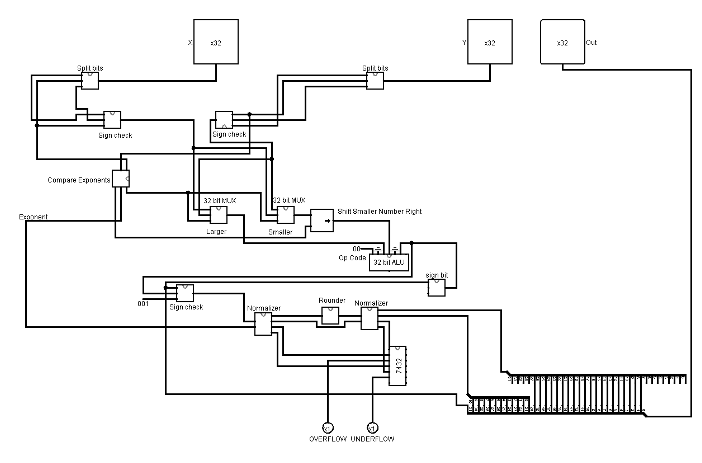

# 📈 Floating Point Unit & 32-Bit ALU

Welcome to the **FPA** project directory. This section features advanced hardware architectures including a complete **32-Bit ALU** built hierarchically from 1-bit slices, and a **Floating Point Adder (FPA)** design.

## 🛠️ Project Overview

This folder contains scalable architectures developed in Logisim:

1. **32-Bit ALU:** A modular design created by cascading 32 individual 1-Bit ALU slices. It is capable of robust 32-bit arithmetic and logical operations, complete with Overflow and Carry flags.
2. **Floating Point Adder (FPA):** A circuit designed to handle arithmetic operations for IEEE 754 floating-point representations.

### **📐 32-Bit ALU Architecture**
*   **Inputs:** 32-bit `A` and `B` buses.
*   **Control Signals:**
    *   `OpCode`: Determines the logical or arithmetic operation.
    *   `Invert_B_Signal`: Toggles generation of 2's complement for subtraction.
*   **Outputs & Flags:**
    *   32-bit Result `C`
    *   `Cin` / `Cout` (Carry Signals)
    *   `OVF` (Overflow Flag)

## 🎯 Getting Started
1. Open up the `.circ` files inside `A1_Group4/` in [Logisim](http://www.cburch.com/logisim/).
2. Explore `Group_4_FPA.circ` for the floating-point addition logic.
3. Dive into `ALU_32_bit/ALU_32_bit.circ` and alter the input pins to observe the cascaded 32-bit arithmetic operations.
