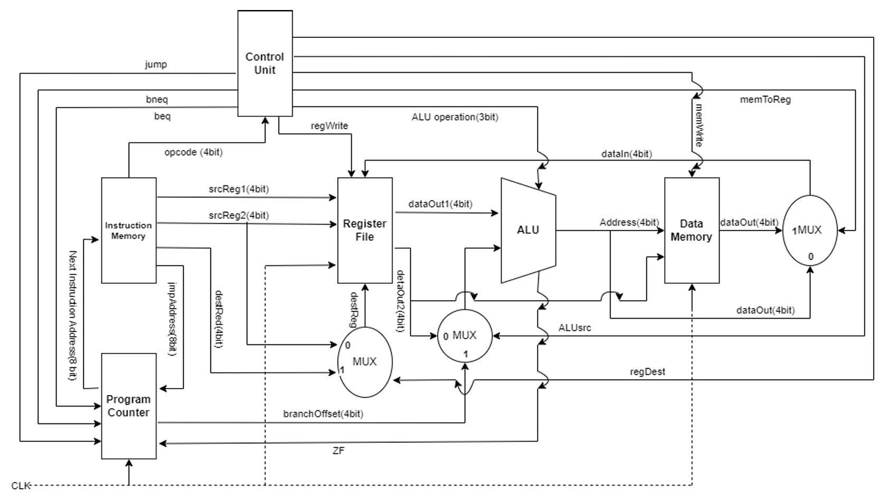
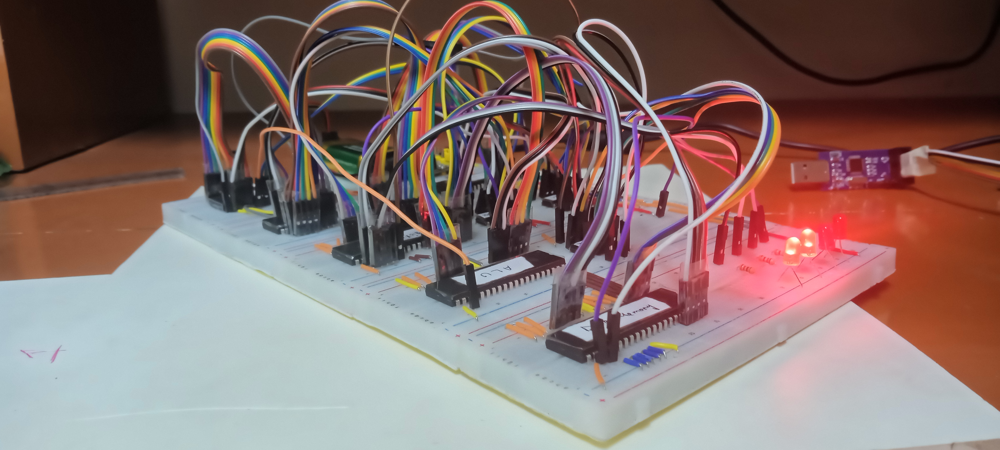

# 🚀 MIPS Processor Simulation

Welcome to the **MIPS Processor Simulation** project directory. This section contains the complete toolchain, assembly, and Proteus hardware simulation files for building an 8-bit/MIPS-like processor architecture using AVR microcontrollers.

## 🛠️ Project Overview

In this project, key MIPS components (ALU, Control Unit, Data Memory, Instruction Memory, Program Counter, and Register File) are independently programmed in C targeting AVR microcontrollers. They are then integrated seamlessly via a Proteus hardware simulation circuit.

### **✨ System Components**

- **Proteus Simulation:** `A1_4_Simulation/MIPS.pdsprj` - The central schematic wiring the AVR microcontrollers together into an integrated MIPS architecture.
- **AVR Modules (Atmel / Microchip Studio):**
  - `ALU`: Arithmetic Logic Unit for executing computations
  - `Control`: Generates and manages datapath control signals
  - `DataMemory`: RAM implementation integration
  - `InstructionMemory`: ROM implementation integration
  - `ProgramCount`: Program Counter (PC)
  - `RegisterFile`: General-purpose component registry (Register File)
- **Compiler/Assembler:** Includes Lex/Yacc scripts (`lexer.lex`, `parser.y`) and a C++ script (`hex_to_array.cpp`) inside `A1_4_Necessary_Contents/` to compile your customized MIPS assembly into machine code.

## 📸 Hardware Implementation

## 🎯 Getting Started

1. **Compilation:** View or modify `A1_4_Necessary_Contents/code.asm` and compile using the provided Makefile tools to generate instruction binaries.
2. **Firmware:** The C source files for each AVR component reside in their respective `A1_4_Simulation/` folders. Build them with Atmel Studio to generate their target `.hex` files.
3. **Simulation:** Open `MIPS.pdsprj` in Labcenter Proteus ISIS and start the simulation to watch the customized MIPS instructions execute in real-time across the microcontrollers!
